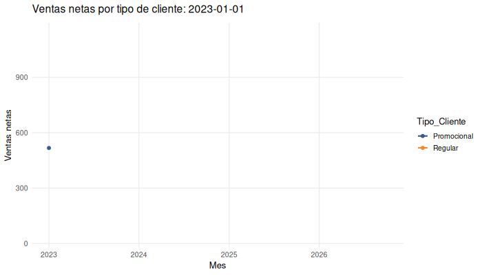
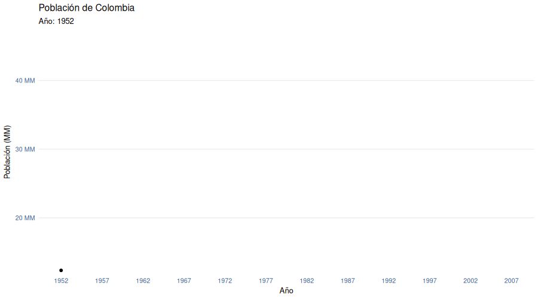

```{r setup, include=FALSE}

knitr::opts_chunk$set(echo = TRUE,comment = NA)
library(ggplot2)
library(dplyr)
library(tidyr)
library(readr)
library(readxl)

# Helper para cargar paquetes opcionales sin romper el Rmd
load_pkg <- function(pkg) {
  if (!requireNamespace(pkg, quietly = TRUE)) {
    message("Paquete no instalado: ", pkg)
    return(FALSE)
  }
  library(pkg, character.only = TRUE)
  TRUE
}

Visitantes <- read_csv("data/Visitantes.csv")
clientes <- read_csv("data/clientes.csv")
ventas <- read_excel("data/ventas.xlsx")
cervezas <- read_csv("data/cervezas.csv")
beer <- read_csv("data/beer.csv")

# colores
source("colores.R")
paleta5 <- c(c11, c21, c31, c41, c51)
paleta4 <- c(c11, c21, c31, c41)

```

<br/><br/>


```{r, echo=FALSE, out.width="100%", fig.align = "center"}
knitr::include_graphics("img/codigo1.png")
```


<br/><br/>


# **Introducción**

La visualización de datos es una de las partes más importantes del análisis de datos, que permite de manera gráfica representar la información con el fin de poder resumirlos e interpretarlos 


Algunas consideraciones

<br/><br/>

|Tipo de variable | Tipos de escala  |  Tipo de gráfico            |  Sintaxis R          | 
|:----------------|:-----------------|:----------------------------|:---------------------|
| Cualitativa     | Nominal          |  diagrama de torta          |  pie(table(x))       |
|                 |                  |                             |                      |
|                 | Ordinal          |  diagrama de barras         |  barplot(table(x))   |
|                 |                  |  diag.barras dobles         |  barplot(table(x,y)) |
|                 |                  |  diag. mosaico              |  plot(x,y)           |
|                 |                  |                             |                      |
|Cuantitativa     | De intervalo     |  diagrama de tallos y hojas | stem(x)              |
|                 |                  |  histograma                 | hist(x)              | 
|                 | De razón         |  diagrama de puntos         | plot(x,y)            |
|                 |                  |  diagrama de densidad       | density(x)           |
|                 |                  |  diagrama de cajas          | boxplot(x)           |
|                 |                  |  diagrama de linea          | plot(x, type="l")    |
|                 |                  |                             |                      |
 
 **Nota**: Además de estas formas de representación gráfica existen otras formas que combinan variables como:
 
 + Mapas
 + Diagrama de Mosaico
 + Diagramas de radar
 

<br/><br/>


# **Cualitativa-nominal**

## **1. Gráfico de tortas**

```{r}
t1 <- table(clientes$categoria_preferida)
pie(t1)
```


```{r}
t1 <- table(clientes$categoria_preferida)
cols <- c("#3B5B8A", "#5D7A9C", "#F28B30", "#F2B33D", "#F0D9BF" )
pie(t1, col = cols)
```


```{r}
t1 <- table(clientes$categoria_preferida)
labs <- names(t1)
pct <- round(t1 / sum(t1) * 100)
labs <- paste(labs, pct, "%")
cols_t1 <- if (length(t1) <= 4) paleta4 else paleta5
pie(t1, 
    labels = labs, 
    main = "Distribución por categoría preferida",
    col = cols_t1[1:length(t1)])
```

<br/><br/><br/>

# **Cualitativa-ordinal**

## **2.Gráfico de barras**

```{r}
library(dplyr)

clientes$edadR[clientes$edad_cliente <=30] = "1.Joven"
clientes$edadR[clientes$edad_cliente>=31 & clientes$edad_cliente <=60] = "2.Adulto"
clientes$edadR[clientes$edad_cliente>=61] = "3.Mayor"
 

barplot(table(clientes$edadR), ylim = c(0, 600))

```


```{r}
ev <- table(clientes$edadR)
cols <- c("#3B5B8A",  "#F2B33D", "#F0D9BF")
barplot(ev,  
        col = cols, 
        main = "Edad de clientes (categorías)",
        las = 1,
        ylim =c(0,600))
```
<br/><br/><br/>

## **3. Gráfico de barras 2 **


```{r}
conteo <- table(ventas$Metodo_Pago, ventas$Tipo_Cliente)
barplot(conteo)

```


```{r}
counts <- table(ventas$Metodo_Pago, ventas$Tipo_Cliente)
cols <- c("#3B5B8A", "#5D7A9C", "#F28B30", "#F2B33D", "#F0D9BF" )
barplot(counts, main = "Método de pago por tipo de cliente",  
        xlab = "Tipo de cliente",
        col = cols,
        legend = rownames(counts),
        las = 1)
```


```{r}
counts <- table(ventas$Tipo_Cliente,ventas$Metodo_Pago)
barplot(counts, main = "Método de pago por tipo de cliente",  
        xlab = "Tipo de cliente",
        col = c( "#5D7A9C", "#F28B30"),
        legend = rownames(counts),
        las = 1)
```


## **4. Diagrama de mosaico **


```{r, message=FALSE, warning=FALSE}
op <- par(no.readonly = TRUE)

# Márgenes un poco más amplios (sobre todo abajo/izquierda)
par(mar = c(6, 6, 4, 2) + 0.1)

mosaicplot(
  ~ gear + vs,
  data = mtcars,
  col  = c("#899DB9", "#F7D18B"),
  las  = 1,
  main = "Número de cambios por  tipo de motor (vs)",
  xlab = "Número de cambios",
  ylab = "Tipo de motor(en V, en Línea)",
  cex.axis  = 0.9,
  cex.main  = 1.1,
  cex.lab   = 1.0,
  border    = "white",
  off       = 0.02
)

par(op)

```

<br/><br/><br/>

# **Variables cuantitativas**

## **5. Diagrama de tallos y hojas**

```{r}
# Diagrama de tallos y hojas
stem(beer$calorias)
```

<br/><br/><br/>

## **6. Histograma**

```{r}
hist(beer$calorias)
```


```{r}
h1=hist(beer$calorias, 
        main = "Calorías", 
        xlab = " ", ylab="frecuencias absolutas", 
        labels=TRUE, 
        col="#3B5B8A",
        ylim = c(0,50),
        las = 1)
abline(v=mean(beer$calorias), col=c31, lwd=2)
grid()
```
<br/><br/><br/>

## **7. Diagrama de densidad**

```{r}
vn <- ventas$Ventas_Netas
plot(density(vn))
```


```{r}
plot(density(beer$calorias),
     main="Distribución de ventas netas", 
     col=c11, 
     lwd=2,
     las=1, 
     xlab = "Ventas netas",
     ylab = "Densidad")
```

<br/><br/><br/>

## **8. Diagrama de cajas** 

```{r}
boxplot(vn)
```


```{r, fig.height=4}
boxplot(beer$calorias, main="Calorías por unidad",
        col=c41,
        las=1,
        horizontal = TRUE)

```

<br/><br/><br/>

## **9. Comparación diagrama de cajas**

```{r}
boxplot(Ventas_Netas ~ Tipo_Cliente, data = ventas)
```


```{r}
par(oma = c(2, 5, 3, 4) )  # margenes de la imagen
boxplot(Ventas_Netas ~ Tipo_Cliente, data = ventas,
        main = "Ventas netas por tipo de cliente", 
        col = paleta5,
        xlab = "ventas netas", ylab = " ", 
        horizontal = TRUE,
        las = 1)
abline(v = mean(ventas$Ventas_Netas), col = c31, lwd = 2)
```

<br/><br/><br/>

## **10. Gráfico de series de tiempo**

```{r}
ventas$fecha <- as.Date("2023-01-01") + 7 * (1:nrow(ventas))
ventas$mes <- as.Date(cut(ventas$fecha, "month"))
serie <- aggregate(Ventas_Netas ~ mes, data = ventas, sum)

plot(serie$mes, serie$Ventas_Netas, type = "l",
     main = "Ventas netas mensuales", 
     col = "#31487A", 
     lwd = 2, xlab = "mes", ylab = "ventas netas")
```


<br/><br/><br/>

## **11. Resumen**

```{r, eval=FALSE }
x=rnorm(100,100,20)
y=rnorm(100,100,25)
z=rbinom(100,4,0.30)
t=1:100
pie(table(z))
barplot(table(z))
stem(x)
hist(x)
boxplot(x)
plot(x,y)
plot(t,y, type="l")
plot(density(x))
```

<br/><br/>

# **Paquetes adicionales**

Hasta el momento se ha utilizado R base para la elaboración de gráficos, a continuación se presentan algunos paquetes que mejoran la construcción de gráficos y su visualización :

<br/><br/>

## **ggplot2**. 


```{r, echo=FALSE, out.width="10%", fig.align='left'}
knitr::include_graphics("img/ggplot2.png")
```


Este paquete de R permite la construcción de gráficos utilizando para ello una "grámatica" de los grafocos, la cual incorpora componentes como : los datos (data), un conjunto de coordenadas ( ), una serie de geometrias (geoms)  

Componentes de un gráfico en ggplot2:

+ **Data**: capa de los datos

+ **Aesthetics**: capa estetica (aes), definimos las variables a utilizar en el gráfico

+ **Geometries**: capa de geometrias, se define el tipo de gráfica a realizar

+ **Facets**: capa de facetas, permite detallar la gráfica por categorias

+ **Statistics**: capa de estadística, permite agregar modelos

+ **Coordinates**: capa de coordenadas, permite ajustar las escalas de los ejes

+ **Theme**: capas de características del gráfico que no dependen de los datos

<br/><br/>

Para empezar, inicialmente se instalar el paquete

```{r, eval=FALSE}
install.packages("ggplot2")
```
Y luego habilitarlo para su uso

```{r}
library(ggplot2)
```

Se empieza con el primero de los lienzo, donde se declara la data que vamos a utilizar

### data


```{r}
fig=ggplot(data=clientes)
fig
```

<br/><br/>

Como segundo paso se definen las variables que se van a utilizar en la construcción del gráfico

### data + aesthetics


```{r}
fig=ggplot(data=clientes,  aes(x=edad_cliente , y=puntos))
fig
```

Luego de tener definida la base y las variables a utilizar se indica la geometria a utilizar, en este caso se trata de puntos


### data + aesthetics + geometries


```{r}
fig=ggplot(data=clientes,  aes(x=edad_cliente , y=puntos))
fig + geom_point(color = "#2C5697")
```

<br/><br/>


Otros elementos a utilizar son :

<br/>

**facet**  que nos ayuda a visualizar el gráfico por factor, construyendo la gráfica para cada mes en este caso

### data + aesthetics + geometries + facets


```{r}
fig=ggplot(data=ventas,  aes(x=Edad , y=Ventas_Netas))+
  geom_point(color = "#3B5B8A") + facet_wrap(~ Metodo_Pago)
fig
```

<br/><br/>


**stat** permite realizar modelos lineales y mostrar asi la relación existente entre las variables 

### data + aesthetics + geometries + facets + statistics


```{r, message=FALSE, warning=FALSE}
fig=ggplot(data=ventas,  aes(x=Edad , y=Ventas_Netas))+
  geom_point(color = "#3B5B8A" ) + 
  facet_wrap(~ Metodo_Pago) +
  stat_smooth(method = "loess" , formula =y ~ x, color = "#F28B30")
fig
```

<br/><br/>


**coordinates**  la cual permite ajustar los ejes , por ejemplo podemos determian el rango de que queremos presentar en la gráfica

### data + aesthetics + geometries + facets + statistics + coordinates


```{r, warning=FALSE, message=FALSE}
fig=ggplot(data=ventas,  aes(x=Edad , y=Ventas_Netas)) + geom_point(color = "#3B5B8A") +
        facet_wrap(~ Metodo_Pago) + 
        stat_smooth(method = "loess" , formula =y ~ x, color = "#F28B30") +
        coord_cartesian(xlim = c(18,70))
fig
```

<br/><br/>

**themes**  finalmente la capa del tema o fondo de la gráfica


### data + aesthetics + geometries + facets + statistics + coordinates + themes


```{r, warning=FALSE, message=FALSE}
fig=ggplot(data=ventas,  aes(x=Edad , y=Ventas_Netas)) + geom_point(color = "#3B5B8A") +
        facet_wrap(~ Metodo_Pago) + 
        stat_smooth(method = "loess" , formula =y ~ x, color = "#F28B30" ) +
        coord_cartesian(xlim = c(18,70)) +
        theme_classic()
fig
```

<br/><br/><br/>

### **Otros ejemplos de ggplot2**

```{r}
ventas$Tipo_Cliente = as.factor(ventas$Tipo_Cliente)
fig2 = ggplot(data=ventas, aes(x=Ventas_Netas, y=Tipo_Cliente)) +
  geom_boxplot(fill = "#3B5B8A", color = "#F2B33D")+
  geom_point(color = c11, alpha = 0.5, position = position_jitter(width = 0.2))+
  ggtitle("Ventas netas por tipo de cliente")+
  labs(x="ventas netas" , y="tipo de cliente")
  
fig2        
```


```{r}
fig3=ggplot(clientes, aes(edad_cliente)) +
       geom_histogram(bins = 7,fill="#5D7A9C", color="#F7F7F7", alpha=0.9)+
       theme_minimal() +
       labs(x = "edad", y = "frecuencia absoluta") +
       ggtitle("Edad de clientes")
fig3 
```


```{r}
fig=ggplot(data = ventas, aes(x = Tipo_Cliente, fill = Metodo_Pago)) + 
      geom_bar(colour= "#3B5B8A", size = 0.3 ) +  
  coord_polar() +
  scale_fill_manual(values = c("#3B5B8A", "#5D7A9C", "#F28B30", "#F2B33D", "#F0D9BF" ))
fig
```
```{r}
# Plot
ggplot(ventas, aes(x = Tipo_Cliente, y = Ventas_Netas, fill = Tipo_Cliente)) +
  geom_boxplot(alpha = 0.6) +
  geom_jitter(color = c1, size = 0.4, alpha = 0.6) +
  scale_fill_manual(values = c("#3B5B8A", "#5D7A9C")) +
  theme_minimal() +
  theme(legend.position = "none",
        plot.title = element_text(size = 11)) +
  ggtitle("Ventas netas por tipo de cliente (geom_jitter)") +
  xlab("")
```


## **highcharter**  


```{r, echo=FALSE, out.width="10%", fig.align='left'}
knitr::include_graphics("img/highcharter.png")
```


Este es un paquete especializado en la creación de gráficos dinámicos que emplea inrnamente  javascript.

Este paquete permite crear varios tipos de gráficos como: diagramas de dispersión, de burbuja, de línea, serie de tiempo, mapas de calor, treemap, gráficos de barras, redes, entre otros.

Gran parte de los gráficos se realizan con la función : ** hchart() ** que es aplicada a objetos 

Inicialmente se instala el paquete por una única vez

```{r, eval=FALSE}
# install.packages("highcharter")
```

Luego se carga para utilizar sus funciones

```{r, message=FALSE,warning=FALSE}
load_pkg("highcharter")
```


```{r, message=FALSE,warning=FALSE, echo=FALSE}
if (load_pkg("highcharter")) {
  hchart(ventas, "scatter", hcaes(x = Edad, y = Ventas_Netas, group = Metodo_Pago)) %>%
    hc_title(text = "Ventas netas vs edad por método de pago")
}
```

<br/><br/>

```{r}
# paquetes requeridos
# install.packages("ggplot2")
library(ggplot2)
# install.packages("ggbeeswarm")
load_pkg("ggbeeswarm")

# gráfico 
if (load_pkg("ggbeeswarm")) {
  ggplot(ventas, aes(x = Tipo_Cliente, y = Ventas_Netas, color = Tipo_Cliente)) +
    geom_beeswarm(cex = 2) +
    scale_color_manual(values = c("#3B5B8A", "#F28B30"))
}
```

<br/><br/>

```{r}
# construccion de la data
df <- cervezas[, c("tipo", "precio")]

# instalacion de paquetes
# install.packages("ggridges")
load_pkg("ggridges")
# install.packages("ggplot2")
library(ggplot2)

# construcción de gráfico
if (load_pkg("ggridges")) {
  ggplot(df, aes(x = precio, y = tipo, fill = tipo, color = tipo)) +
    geom_density_ridges(alpha = 0.6) +
    scale_fill_manual(values =c("#3B5B8A", "#5D7A9C", "#F28B30", "#F2B33D", "#F0D9BF" )) +
    scale_color_manual(values = c("#F0D9BF", "#F2B33D", "#F28B30", "#5D7A9C","#3B5B8A"))
}
```

<br/><br/>

```{r}
# Datos
v_m <- ventas$Ventas_Netas[ventas$Genero == "Mujer"]
v_h <- ventas$Ventas_Netas[ventas$Genero == "Hombre"]

# Estimaciones de densidad
denx <- density(v_m)
deny <- density(v_h)

# Gráfico
plot(denx,
     ylim = c(0, max(c(denx$y, deny$y))),
     xlim = c(min(c(denx$x, deny$x)),
              max(c(denx$x, deny$x))),
     las=1, main="Ventas netas por género", xlab="ventas netas")
lines(deny)

# Colorear las áreas
polygon(denx, col = adjustcolor("#3B5B8A", alpha.f = 0.6))
polygon(deny, col = adjustcolor("#F28B30", alpha.f = 0.6))
```

<br/><br/>

## **plotly**


```{r, echo=FALSE, out.width="10%", fig.align='left'}
knitr::include_graphics("img/plotly.png")
``` 

<br/>

```{r, eval=FALSE, message=FALSE, warning=FALSE}
library(dplyr)
library(plotly)

set.seed(123)

# Datos de ejemplo (ambas cuantitativas)
datos <- data.frame(
  Gasto_Publicidad = runif(80, 200, 2000),                # X cuantitativa
  Ventas           = 5000 + 8*runif(80, 200, 2000) + rnorm(80, 0, 800)  # Y cuantitativa
)

p <- plot_ly(
  data = datos,
  x = ~Gasto_Publicidad,
  y = ~Ventas,
  type = "scatter", mode = "markers",
  text = ~paste0("Publicidad: $", round(Gasto_Publicidad, 0),
                 "<br>Ventas: $", round(Ventas, 0)),
  hoverinfo = "text",
  marker = list(size = 10, opacity = 0.8)
) %>%
  layout(
    title = "Relación entre publicidad y ventas",
    xaxis = list(title = "Gasto en publicidad ($)"),
    yaxis = list(title = "Ventas ($)")
  )

p

```

## **gganimate (GIF)** 

Ejemplo de gráfico dinámico que cambia en el tiempo y se exporta como GIF.

```{r, eval=FALSE, message=FALSE, warning=FALSE}
# install.packages(c("gganimate","gifski","transformr")) # instala paquetes
library(dplyr)
library(ggplot2)
library(gganimate)
library(gifski)

# IMPORTANTE:
# NO cargues el paquete {animation} en este documento, o se pisa animate().
# Si lo necesitas en otro chunk, usa gganimate::animate() explícito.

# 1) Crear fechas y mes
ventas <- ventas %>%
  mutate(
    fecha = as.Date("2023-01-01") + 7 * (row_number() - 1),
    mes   = as.Date(cut(fecha, "month"))
  )

# 2) Resumir por mes y tipo de cliente
resumen <- ventas %>%
  group_by(mes, Tipo_Cliente) %>%
  summarise(Ventas_Netas = sum(Ventas_Netas, na.rm = TRUE), .groups = "drop")

# 3) Gráfico base
p <- ggplot(resumen, aes(x = mes, y = Ventas_Netas, color = Tipo_Cliente, group = Tipo_Cliente)) +
  geom_line(linewidth = 1) +
  geom_point(size = 2) +
  scale_color_manual(values = c("#3B5B8A", "#F28B30"))  +   # paleta institucional (5 colores)
  labs(
    title = "Ventas netas por tipo de cliente: {frame_along}",
    x = "Mes", y = "Ventas netas"
  ) +
  theme_minimal(base_size = 13) +
  theme(panel.grid.minor = element_blank()) +
  transition_reveal(along = mes)

# 4) Render GIF (usa gganimate::animate para evitar conflictos)
anim <- gganimate::animate(
  p, nframes = 80, fps = 10, width = 700, height = 400,
  renderer = gifski_renderer()
)

dir.create("img", showWarnings = FALSE)
anim_save("img/ventas_tiempo.gif", anim)

```


```{r, echo=FALSE, out.width="100%", fig.align = "center"}

```


```{r, eval=FALSE, message=FALSE, warning=FALSE}
# install.packages(c("gganimate","gifski","transformr")) # instala paquetes
library(dplyr)
library(ggplot2)
library(gganimate)
library(gifski)

p <- datos %>%
  filter(country == "Colombia") %>%
  mutate(
    pop_mm = pop / 1e6,
    # Etiquetas solo en algunos años para no saturar
    etiqueta = if_else(year %in% c(min(year), 1970, 1990, 2010, max(year)),
                       paste0(number(pop_mm, accuracy = 0.1), " MM"),
                       NA_character_)
  ) %>%
  ggplot(aes(year, pop_mm)) +
  geom_line(linewidth = 1) +
  geom_point(size = 2) +
  geom_text_repel(
    aes(label = etiqueta),
    na.rm = TRUE,
    size = 3.6,
    min.segment.length = 0,
    box.padding = 0.25,
    point.padding = 0.2,
    max.overlaps = Inf
  ) +
  scale_color_manual(values = "#5D7A9C") +
  scale_x_continuous(breaks = seq(1952, 2007, by = 5)) +
  scale_y_continuous(
    labels = function(x) paste0(number(x, accuracy = 1), " MM"),
    expand = expansion(mult = c(0.02, 0.10))
  ) +
  labs(
    title = "Población de Colombia",
    subtitle = "Año: {frame_along}",
    x = "Año",
    y = "Población (MM)"
  ) +
  theme_minimal(base_size = 13) +
  theme(
    panel.grid.minor = element_blank(),
    panel.grid.major.x = element_blank(),
    plot.title = element_text(face = "bold"),
    axis.title = element_text(face = "bold"),
    axis.text = element_text(color = "gray20")
  ) +
  transition_reveal(along = year)
p
```

<br/><br/>


```{r, echo=FALSE, eval=FALSE, out.width="100%", fig.align = "center"}
ok_anim <- load_pkg("gapminder") &&
  load_pkg("gganimate") &&
  load_pkg("gifski") &&
  load_pkg("ggrepel")

if (ok_anim) {
  datos <- gapminder::gapminder

  p <- datos %>%
    filter(country == "Colombia") %>%
    mutate(
      pop_mm = pop / 1e6,
      # Etiquetas solo en algunos años para no saturar
      etiqueta = if_else(year %in% c(min(year), 1970, 1990, 2010, max(year)),
                         paste0(scales::number(pop_mm, accuracy = 0.1), " MM"),
                         NA_character_)
    ) %>%
    ggplot(aes(year, pop_mm)) +
    geom_line(linewidth = 1) +
    geom_point(size = 2) +
    ggrepel::geom_text_repel(
      aes(label = etiqueta),
      na.rm = TRUE,
      size = 3.6,
      min.segment.length = 0,
      box.padding = 0.25,
      point.padding = 0.2,
      max.overlaps = Inf
    ) +
    scale_color_manual(values = paleta4[1]) +
    scale_x_continuous(breaks = seq(1952, 2007, by = 5)) +
    scale_y_continuous(
      labels = function(x) paste0(scales::number(x, accuracy = 1), " MM"),
      expand = expansion(mult = c(0.02, 0.10))
    ) +
    labs(
      title = "Población de Colombia",
      subtitle = "Año: {frame_along}",
      x = "Año",
      y = "Población (MM)"
    ) +
    theme_minimal(base_size = 13) +
    theme(
      panel.grid.minor = element_blank(),
      panel.grid.major.x = element_blank(),
      plot.title = element_text(face = "bold"),
      axis.title = element_text(face = "bold"),
      axis.text = element_text(color = "#3B5B8A")
    ) +
    transition_reveal(along = year)

  gif <- gganimate::animate(
    p, fps = 20, width = 900, height = 500,
    renderer = gganimate::gifski_renderer()
  )
  gganimate::anim_save("img/poblacion_colombia.gif", gif)
} else {
  message("Bloque omitido: faltan paquetes para generar poblacion_colombia.gif")
}

```

```{r, echo=FALSE, out.width="100%", fig.align = "center"}
if (file.exists("img/poblacion_colombia.gif")) {
  
} else {
  plot.new()
  text(0.5, 0.5, "GIF no disponible: revise paquetes opcionales", cex = 0.9)
}
```

```{r, echo=FALSE}
ok_rank <- load_pkg("gapminder") && load_pkg("gganimate")

if (ok_rank) {
  gapminder::gapminder %>%
    dplyr::select(country, pop, year, continent) %>%
    # for each year we assign a rank
    group_by(year) %>%
    arrange(year, -pop) %>%
    # assign ranking
    mutate(rank = 1:n()) %>%
    filter(rank <= 20) ->
    ranked_by_year

  my_theme <- theme_minimal(base_family = "Times") +
    theme(axis.text.y = element_blank()) +
    theme(axis.ticks.y = element_blank()) +
    theme(panel.grid.major.y = element_blank()) +
    theme(panel.grid.minor = element_blank())

  ranked_by_year %>%
    ggplot() +
    aes(xmin = 0,
        xmax = pop / 1000000) +
    aes(ymin = rank - .45,
        ymax = rank + .45,
        y = rank) +
    facet_wrap(~ year) +
    geom_rect(alpha = .7) +
    aes(fill = continent) +
    scale_fill_manual(values = c("#3B5B8A", "#F28B30", "#F2B33D", "#A7ABB9")) +
    scale_x_continuous(
      limits = c(-800, 1400),
      breaks = c(0, 400, 800, 1200)) +
    geom_text(col = "gray13",
              hjust = "right",
              aes(label = country),
              x = -50) +
    scale_y_reverse() +
    labs(fill = NULL) +
    labs(x = 'Population (millions)') +
    labs(y = "") +
    my_theme ->
    my_plot

  my_plot +
    facet_null() +
    scale_x_continuous(
      limits = c(-355, 1400),
      breaks = c(0, 400, 800, 1200)) +
    geom_text(x = 1000, y = -10,
              family = "Times",
              aes(label = as.character(year)),
              size = 10, col = "grey18") +
    aes(group = country) +
    gganimate::transition_time(year)
} else {
  message("Bloque omitido: faltan paquetes para animación por ranking")
}


```


## **fmsb** 

<br/><br/>

### **gráficos de radar** 

Paquete para el trabajo en Estadística Medica que se utiliza para la construcción de un diagrama de radar

```{r}
# install.packages("fmsb")
load_pkg("fmsb") # carga fmsb si está disponible

if (load_pkg("fmsb")) {
  set.seed(1) # fija semilla
  df <- data.frame(rbind(rep(10, 8), # máximos
                         rep(0, 8), # mínimos
                         matrix(sample(0:10, 8), nrow = 1))) # datos
  colnames(df) <- paste("Var", 1:8) # nombres

  radarchart(df, # radar
             cglty = 1, cglcol = "gray", # grid
             pcol = c11, plwd = 2, # línea
             pfcol = adjustcolor(c21, alpha.f = 0.25)) # relleno
}

```
<br/><br/>

```{r}
# install.packages("fmsb")
load_pkg("fmsb") # carga fmsb si está disponible
# matriz de datos
if (load_pkg("fmsb")) {
  df2 <- data.frame(rbind(rep(10, 8), rep(0, 8), # máximos y mínimos
                          matrix(sample(0:10, 24,
                                        replace = TRUE), # datos
                                 nrow = 3)))
  colnames(df2) <- paste("Var", 1:8) # nombres
  # colores de areas
  areas <- c(adjustcolor(c11, alpha.f = 0.25), # grupo 1
             adjustcolor(c31, alpha.f = 0.25), # grupo 2
             adjustcolor(c41, alpha.f = 0.25)) # grupo 3

  radarchart(df2, # radar
             cglty = 1,       # tipo de línea del grid
             cglcol = "gray", # color líneas grid
             pcol = c(c11, c31, c41),      # color de líneas
             plwd = 2,        # ancho de línea
             plty = 1,        # tipo de línea
             pfcol = areas)   # color de las áreas 

  legend("topright", # leyenda
         legend = paste("Grupo", 1:3), # etiquetas
         bty = "n", pch = 20, col = areas, # estilo
         text.col = "grey25", pt.cex = 2) # estilo texto
}

```

<br/><br/>

### **gráfico de barras polar**


```{r, message=FALSE, warning=FALSE}


```

 <br/><br/><br/>
 
# **Mapas** 
 
En el siguiente enlace encontrará los archivos para la construcción de los mapas en formato .shp (debe copiar los cuatro archivos)

Archivos .shp : https://sites.google.com/site/seriescol/shapes
 
A continuación el código para el mapa de Cali sin información (usa `sf`).
 
<br/>

### **Mapa de Cali** 

```{r}
load_pkg("sf") # carga sf si está disponible

cali <- tryCatch( # intenta leer el shapefile
  sf::st_read("map/cali/cali.shp", quiet = TRUE), # ruta del .shp
  error = function(e) NULL # si falla, devuelve NULL
)

if (is.null(cali)) { # valida que se haya cargado
  message("No se pudo leer map/cali/cali.shp. Verifique que exista el .dbf.") # aviso
} else { # si existe, grafica
  plot(sf::st_geometry(cali), col = "#F0D9BF" , border = "#3B5B8A", # geometría y colores
       main = "Cali - mapa base") # título
}
```
 <br/>
 
 

 
### **Mapa de Cali con indice**
 
Para mostrar la información se debe incorporar un vector al objeto **cali** que contiene la información para el mapa. este objeto en formato lista tiene incorporada una data que contiene varias columnas al cual se le adiciona la información a publicar.  

En el caso de Cali tiene 22 comunas se adiciona un vector con 22 valores con el nombre de indice
 
<br/><br/>

```{r}
if (!is.null(cali)) { # solo si el mapa existe
  set.seed(1) # reproducibilidad
  cali$indice <- runif(nrow(cali), min = 0, max = 100) # indicador simulado

  ggplot(cali) + # inicia gráfico
    geom_sf(aes(fill = indice), color = "white", linewidth = 0.2) + # polígonos
    scale_fill_viridis_c(option = "C") + # paleta
    labs(title = "Cali - índice simulado", fill = "Índice") + # etiquetas
    theme_minimal() # tema
}
```


<br/><br/>

### **Mapa de Colombia**

Para el caso de Colombia se obtiene el archivo `depto.shp` que contiene la información por departamentos (33). A continuación se simula un indicador y se presenta en el mapa.

<br/><br/>
```{r}
load_pkg("sf") # carga sf si está disponible

mapco <- tryCatch( # intenta leer el shapefile
  sf::st_read("map/colombia/depto.shp", quiet = TRUE), # ruta del .shp
  error = function(e) NULL # si falla, devuelve NULL
)

if (is.null(mapco)) { # valida que se haya cargado
  message("No se pudo leer map/colombia/depto.shp.") # aviso
} else { # si existe, simula y grafica
  set.seed(2) # reproducibilidad
  mapco$indice <- runif(nrow(mapco), min = 0, max = 100) # indicador simulado

  ggplot(mapco) + # inicia gráfico
    geom_sf(aes(fill = indice), color = "white", linewidth = 0.1) + # polígonos
    scale_fill_viridis_c(option = "D") + # paleta
    labs(title = "Colombia - indicador simulado", fill = "Índice") + # etiquetas
    theme_minimal() # tema
}
```
<br/>


Para representar información en el mapa seden ingresar una vector con 33 valores, igual numero de departamentos en el mismo orden en que se encuentran los nombre de los departamento en el archivo mapco

<br/>

Si se quiere representar un mapa con un indicador real por departamento, se debe construir una tabla con los valores en el mismo orden del archivo **depto.shp** y adicionarla como variable al objeto `mapco`.

En este ejemplo se simula un indicador para evitar depender de archivos externos:
 

<br/><br/>

```{r}
ok_sp <- load_pkg("sp") &&
  load_pkg("rgdal") &&
  load_pkg("raster") &&
  load_pkg("RColorBrewer")

if (ok_sp) {
  mi.palette <- RColorBrewer::brewer.pal(n = 7, name = "OrRd")   # paleta de colores
  mapco <- raster::shapefile("map/colombia/depto.shp")  # importa mapa en formato .shp

  set.seed(3)
  indicador <- round(runif(nrow(mapco@data), min = 50, max = 500)) # indicador simulado
  mapco@data$indicador <- indicador # se adiciona variable con 33 valores = 33 dptos, en mismo orden

  sp::spplot(mapco["indicador"], col.regions = mi.palette, cuts = 6)  # mapa
} else {
  message("Bloque omitido: faltan paquetes legacy de mapas (sp/rgdal/raster)")
}
```


<br/><br/>


<br/><br/><br/> 

#  **Margenes de los gráficos**

```{r}
# Grafico normal
x=rnorm(100,100,20)
plot(density(x))
```

<br/> <br/> 

### **margenes de la grafica  c(bottom, left, top, right)**

```{r}

par(mar = c(5, 4, 4, 2) + 0.1)
x=rnorm(100,100,20)
plot(density(x))
```

<br/> <br/> 


###  **margenes de la gráfica**

```{r}

par(mai = c(1.5, 1.5, 1.5, 1.5))
x=rnorm(100,100,20)
plot(density(x))

```

<br/> <br/> 

### **Matriz de gráficos mfrow = c(2, 2)**

```{r}
x=rnorm(100,100,20)
y=rnorm(100,100,25)
z=rbinom(100,4,0.30)
t=1:100
par(mfrow = c(2, 2) ) # definición de la matriz

plot(density(x))
barplot(table(z))
hist(x)
plot(x,y)
```

<br/> <br/> 

### **margenes exteriores c(bottom, left, top, right)**

```{r}

par(mfrow = c(2, 2),   # matriz de graficos 2x2
    oma = c(3, 5, 2, 4) )  # margenes de la imagen
plot(density(x))
barplot(table(z))
hist(x)
plot(x,y)

```

<br/> <br/> 

# **Tamaño texto**


```{r}
x=rnorm(100,100,20)
plot(density(x),cex.lab=.8,  # tamaño de etiqueta ejes
                cex.axis=2, # tamaño escalas de los ejes 
                cex.main=1.5, # tamaño del titulo
                cex.sub=1)    # tamaño del subtitulo
```


https://r-charts.com/es/r-base/margenes/


<br/> <br/> <br/> 

# **Flexdashboard**

Este paquete permite la construcción de tableros que pueden ser publicados en formato html. A continuación se describen las principales características y la forma que podemos construir un tablero

Iniciaremos cargando el paquete (por una única vez)
```{r, eval=FALSE, message=FALSE, warning=FALSE}
# install.packages("flexdashboard")
```

<br/> 

Tambien debemos activarlo, aunque este procedimiento viene en el formato que nos proporciona RStudio 

```{r, eval=FALSE, message=FALSE, warning=FALSE}
library(flexdashboard)
```

<br/> 

Inicialmente utilizamos la plantilla que para este propósito tiene RStudio, entrando por el menú : **File/ New file /  RMarkdown..**

{width=50%}

{width=50%}

Este procedimiento genera un formato para un tablero que puede ser modificado o ajustado a nuestras necesidades

{width=60%}

<br/> 

En este formato podemos distinguir varias partes :

+ Encabezado :  donde se define la estructura del tablero y los temas 
+ Bloque setup . Donde colocamos las instrucciones generales de R , como puede ser cargar las bases de datos que seran utilizadas durante todo el documento, ademas de cargar las librerias necesarias  
+ Definicion de columnas o filas del tablero y hojas del tablero
+ Bloques de R con el contenido


<br/> <br/> 

## **Uso de color**

https://r-charts.com/colors/

http://brandcolors.net/

<br/> <br/> 

## **Algunos paquetes**

[Selección de paquetes de Sharpm Machis](https://www.computerworld.com/article/2921176/great-r-packages-for-data-import-wrangling-visualization.html)

<br/> <br/> <br/> 

## **Ejemplo de tablero**

<br/> <br/> 


```{r, echo=FALSE, out.width="100%", fig.align = "center"}
knitr::include_graphics("img/tablero-01.png")
```

<br/> <br/> 

<html>
<button id="dl-rmd" style="background:c50;color:#fff;padding:7px 20px;border:0;border-radius:6px;cursor:pointer">
  📥 Descargar código Rmd
</button>
<script>
const downloadFile = async (urlRaw, fileName) => {
  const resp = await fetch(urlRaw);
  const blob = await resp.blob();
  const url  = URL.createObjectURL(blob);
  const a = document.createElement('a');
  a.href = url;
  a.download = fileName;
  document.body.appendChild(a);
  a.click();
  a.remove();
  URL.revokeObjectURL(url);
}

document.getElementById('dl-rmd').addEventListener('click', async () => {
  const urlRaw = 'https://raw.githubusercontent.com/dgonxalex80/300MAE018B/main/tablero1/tablero-01.Rmd';
  await downloadFile(urlRaw, 'tablero-01.Rmd');
});
</script>
</html>

<br/> <br/> 

## Descarga de practica

<html>
<button id="dl-practica" style="background:c50;color:#fff;padding:7px 20px;border:0;border-radius:6px;cursor:pointer">
  📥 Descargar práctica (R)
</button>
<script>
document.getElementById('dl-practica').addEventListener('click', async () => {
  const urlRaw = 'https://raw.githubusercontent.com/dgonxalex80/300MAE018B/main/practica_beer.R';
  await downloadFile(urlRaw, 'practica_beer.R');
});
</script>
</html>


<br/> <br/> 

## Descarga de base de datos

<html>
<button id="dl-beer" style="background:c50;color:#fff;padding:7px 20px;border:0;border-radius:6px;cursor:pointer">
  📥 Descargar beer.csv
</button>
<script>
document.getElementById('dl-beer').addEventListener('click', async () => {
  const urlRaw = 'https://raw.githubusercontent.com/dgonxalex80/300MAE018B/main/data/beer.csv';
  await downloadFile(urlRaw, 'beer.csv');
});
</script>
</html>

<br/> <br/> 
