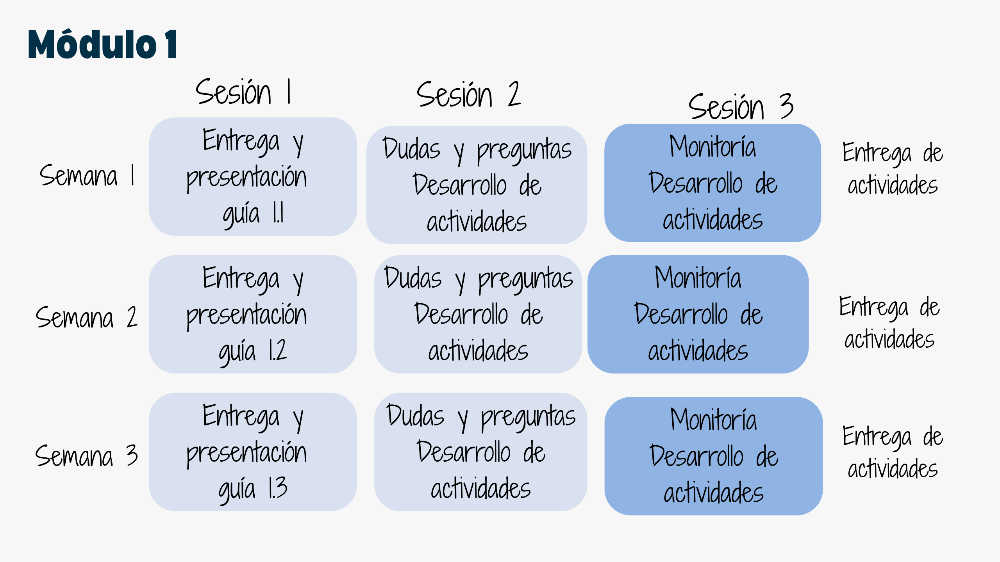

---
title: <span style="color:#235784"> </span>  
author: "dgonzalez "
subtitle: <span style="color:#235784"> </span> 
output:
  html_document:
    toc: true
    toc_depth: 2
    toc_float: yes
    code_folding: hide
    theme: flatly
    css: style.css
---  

```{r setup, include=FALSE}
knitr::opts_chunk$set(echo = TRUE, comment = NA)
# colores
source("colores.R")
```


# <span style="color:#2C5697">**Estadística para la toma de decisiones - B**</span>


```{r, echo=FALSE, out.width="70%", fig.align = "center"}
 knitr::include_graphics("img/modulos.png")
```


<br/><br/><br/>

## **Cronograma**

<div class="highlight-box">

```{r, echo=FALSE, out.width="100%", fig.align = "center"}
knitr::include_graphics("img/calendario.png")
```

</div>


<br/><br/>

## **Salones de clase**

<div class="box2">


```{r, echo=FALSE, out.width="100%", fig.align = "center"}
 knitr::include_graphics("img/salones.png")
```

</div>


<br/><br/>

## **Metodología**

<div class="box2">


```{r, echo=FALSE, out.width="100%", fig.align = "center"}

```
</div>

<br/>


<div class="box2">

#### **Profesor** : Daniel Enrique González

correo : dgonzalez@javerianacali.edu.co

<br/>

#### **Monitor** : José Alejandro Echeverry 

</div>

<br/>

## **Atención estudiantes**

<div class="box2">

```{r, echo=FALSE, out.width="100%", fig.align = "center"}
# knitr::include_graphics("img/atencion.png")
```

</div>


<br/><br/><br/>

## **Supletorios**
<div class="box2">


</div>


<br/><br/><br/>


<br/><br/><br/>

 
 
