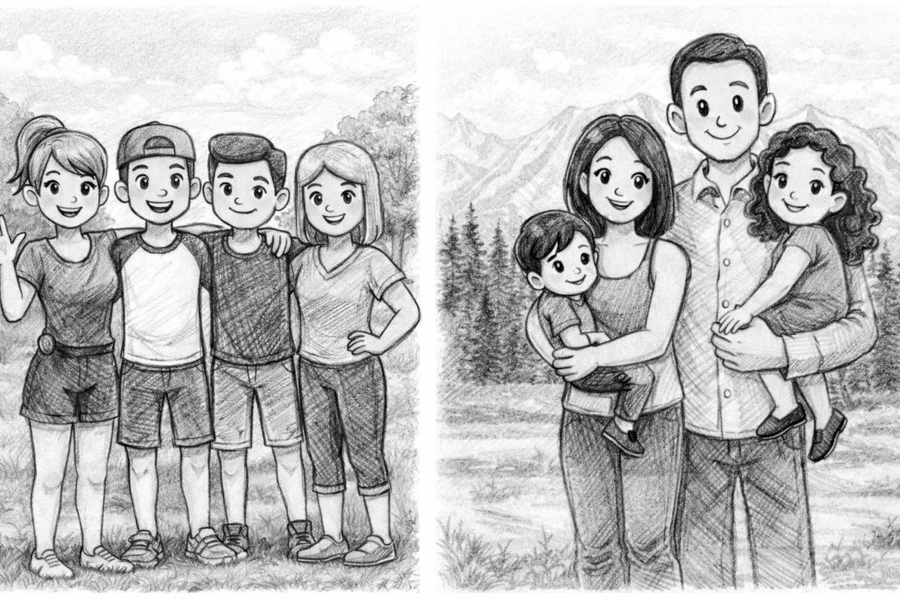

---
title: <span style="color:#235784"> </span>  
subtitle: <span style="color:#235784">**Unidad 1.1**</span> 
author: "dgonzalez "
output:
  html_document:
    toc: true
    toc_depth: 2
    toc_float: yes
    code_folding: hide
    theme: flatly
---    


```{r setup, include=FALSE}
knitr::opts_chunk$set(comment = NA)

library(RColorBrewer)
library(summarytools)
library(knitr)
library(readxl)
library(tidyverse)
#install.packages('remotes')  # solo una vez
library(remotes) # solo una vez
data(Colombia23)
library(readxl)

## colores
source("colores.R")
knitr::opts_chunk$set(echo = TRUE, message = FALSE, warning = FALSE, comment = NA)
library(psych)
library(summarytools)

# install.packages("devtools")
#devtools::install_github("dgonxalex80/paquete018")
#library(paquete018)
library(readr)
Visitantes <- read_csv("data/Visitantes.csv")
clientes <- read_csv("data/clientes.csv")

library(readxl)
ventas <- read_excel("data/ventas.xlsx")


nf=c(4.1, 2.7, 3.1, 3.2, 3.0, 3.2, 2.0, 2.4, 1.6, 3.2, 3.1, 2.6, 2.0, 2.4, 2.8, 3.3, 4.0, 3.4, 3.0, 3.1, 2.7, 2.7, 3.0, 3.8, 3.2, 2.2, 3.5, 3.5, 3.8, 3.5, 3.9, 4.2, 4.3, 3.9, 3.2, 3.5, 3.5, 3.7, 4.1, 3.7, 3.5, 3.6, 3.2, 3.1, 3.4, 3.0, 3.0, 3.0, 2.7, 1.7, 3.6, 2.1, 2.4, 3.0, 3.1, 2.5, 2.5, 3.6, 2.2, 2.4, 3.1, 3.3, 2.7, 3.7, 3.0, 2.7, 3.0, 3.2, 3.1, 2.4, 3.0, 2.7, 2.5, 3.0, 3.0, 3.0, 3.2, 3.1, 3.8, 4.1, 3.7, 3.5, 3.0, 3.7, 3.7, 4.1, 3.7, 3.9, 3.7, 2.0)

```
<br/><br/>

```{r, echo=FALSE, out.width="70%", fig.align = "center"}
knitr::include_graphics("img/recurso1.png")
```

<br/><br/>


### **¿Qué es un indicador?**

<br/><br/>


```{r, echo=FALSE, out.width="100%", fig.align = "center"}

```

<br/><br/>

Cuando nos subimos a un auto observamos un tablero con muchos indicadores que permiten al conductor validar el estado del vehículo. Todos los podemos visualizar al tiempo con el fin de darnos una idea del nivel de combustible, la temperatura, el estado de la batería, si alguna puerta está abierta, la velocidad a la que se viaja, entre otros.

<br/>

Al igual que la situación anterior, cuando nos enfrentamos a un análisis de datos, requerimos resumirlos en indicadores, tablas y gráficos que nos permitan un análisis más fácil.

<br/> <br/> <br/>

Tomaremos una base de datos de clientes para analizar indicadores asociados a hábitos de compra y características generales.

```{r}
library(DT)
# CAMBIAR DATA ---------------------------------------------------
DT::datatable(head(clientes, 218),fillContainer = FALSE, options = list(pageLength = 8))
# DT::datatable(head(Visitantes, 389455),fillContainer = FALSE, options = list(pageLength = 8))
```
Las bases de datos utilizadas se encuentran en el directorio `data/` del curso.

<br/> <br/> <br/>

## **Tablas de frecuencia** 


 <br/>
 
### **Tablas de frecuencia para variables cualitativas**

<br/>
<br/>

Las distribuciones de frecuencia o también llamadas tablas de frecuencia nos sirven para agrupar los datos y así permitir resumir para poder tener una idea más clara de sus características.

Para las variables cualitativas la tabla posee 3 columnas : 

+ c1: los diferentes valores que toma la variable. 

+ c2:  **frecuencia absoluta** que consiste en el conteo para cada uno de los valores distintos que toma la variable. 

+ c3: **frecuencia relativa** que corresponde al porcentaje de la cantidad de datos para cada uno de los valores.


 <br/> <br/>

```{r, echo=TRUE, message=FALSE, warning=FALSE}
# Forma simple
# tabla1 <- table(Visitantes$Mes)
# names(tabla1) <- c("Ene", "Feb", "Mar", "Abr", "May", "Jun", "Jul", "Ago", "Sep", "Oct", "Nov", "Dic")
# tabla1

# Forma simple
# CAMBIAR DATA ---------------------------------------------------
table(clientes$categoria_preferida)


```
 
 <br/> <br/>

```{r, eval=FALSE,  results='asis'}
#utilizando summarytools
categoria=as.factor(clientes$categoria_preferida)
summarytools::freq(categoria, cumul = FALSE)

```

<pre>
Frequencies  

                    Freq   % Valid   % Total
----------------- ------ --------- ---------
        Alimentos    199     19.90     19.90
         Deportes    210     21.00     21.00
      Electrónica    215     21.50     21.50
            Hogar    206     20.60     20.60
             Ropa    170     17.00     17.00
            Total   1000    100.00    100.00
<pre/>


 
### **Tablas de frecuencia para variables cuantitativas**

Para las variables cuantitativas las tablas de frecuencias tienen una presentación diferente a la vista anteriormente. Como se trata de variables con un gran número de valores diferentes, es necesario dividirlas por intervalos.

Cuando tenemos los datos sin agrupar nos es difícil extraer información que nos permita hacer un análisis de los mismos

```{r}
nf=c(4.1, 2.7, 3.1, 3.2, 3.0, 3.2, 2.0, 2.4, 1.6, 3.2, 3.1, 2.6, 2.0, 2.4, 2.8, 3.3, 4.0, 3.4, 3.0, 3.1, 2.7, 2.7, 3.0, 3.8, 3.2, 2.2, 3.5, 3.5, 3.8, 3.5, 3.9, 4.2, 4.3, 3.9, 3.2, 3.5, 3.5, 3.7, 4.1, 3.7, 3.5, 3.6, 3.2, 3.1, 3.4, 3.0, 3.0, 3.0, 2.7, 1.7, 3.6, 2.1, 2.4, 3.0, 3.1, 2.5, 2.5, 3.6, 2.2, 2.4, 3.1, 3.3, 2.7, 3.7, 3.0, 2.7, 3.0, 3.2, 3.1, 2.4, 3.0, 2.7, 2.5, 3.0, 3.0, 3.0, 3.2, 3.1, 3.8, 4.1, 3.7, 3.5, 3.0, 3.7, 3.7, 4.1, 3.7, 3.9, 3.7, 2.0)
nf
```

Una primera aproximación puede ser el diagrama de tallos y hojas, que consiste en separar los dígitos de los datos en dos: una primera parte que se repite, llamada tallo, y otra parte que tiene diversos valores. Este diagrama también nos permite ordenar los datos de menor a mayor.

```{r}

stem(nf)

```

Una forma de construir una tabla de frecuencias por intervalos es utilizando la función `graph.freq` del paquete agricolae.

```{r,  echo=TRUE, message=FALSE, warning=FALSE}
library(agricolae)

k <- 6
brks <- pretty(range(nf, na.rm = TRUE), n = k)
h2 <- agricolae::graph.freq(nf, plot = FALSE, breaks = brks)
t2 <- agricolae::table.freq(h2)
colnames(t2) <- c("LI","LS","Marca_Clase","Frec.Abs","Frec.Rel","Frec.Abs.Ac","Frec.Rel.Ac")
t2

```
Frec.Abs : Frecuencia absoluta <br/>
Frec.Rel : Frecuencia relativa <br/><br/>
Frec.Abs.Ac : Frecuencia Absoluta Acumulada <br/>
Frec.Rel.Ac : Frecuencia Relativa Acumulada 

 <br/> <br/>

Si se requiere dividir el rango en intervalos determinados se utiliza la función `cut` 
 
```{r}

nota <- cut(
  nf,
  breaks = c(0, 0.99, 1.99,2.99,3.99,5),   # cubre TODO
  right = FALSE,            # [a, b) incluye el límite izquierdo
  include.lowest = TRUE
)

levels(nota) <- c(
  "0.0 - 0.9",
  "1.0 - 1.9",
  "2.0 - 2.9",
  "3.0 - 3.9",
  "4.0 - 5.0")

as.data.frame(table(nota))

```
 
 
 <br/> <br/> <br/>
 

 
 
 
## **Rango percentil**

 <br/>
 
Es un número que divide la muestra en dos partes. $x$ % de los datos de la muestra son iguales o menores que $P_{x}$ y un $(100-x)$ % por encima de él.


```{r, echo=FALSE, out.width="70%", fig.align = "center"}
 knitr::include_graphics("img/carrera2.png")
```

 <br/>
 
 Para ilustrar el concepto, pensemos en que participamos de una carrera y que el grupo está conformado por 100 corredores. El percentil dará cuenta de mi posición dentro del grupo. Por ejemplo, si mi posición en la carrera en orden de llegada es la décima, indica que por detrás de mí están 90 atletas. Indica esto que soy el percentil 90 ($P_{90}$).
 
 <br/> <br/>
 
 
### **Reto :** 
 
 Qué significado tiene:
 
  <br/>
  
+ Participar en una carrera **K10** y ocupar el percentil 30 : $P_{30}$

+ Una nota en un examen de matemáticas ocupó el percentil 90 : $P_{90}$

+ Que significa: $P_{25}$ ; $P_{50}$ ;  $P_{75}$


 <br/> <br/> <br/>
 
### **Diagrama de cajas** 

 <br/>
 
```{r, warning=FALSE, message=FALSE, fig.height=3, fig.width=12}
# Paquetes
library(ggplot2)

# ---- Datos de ejemplo (puedes reemplazar "tiempo" por tu vector real) ----
set.seed(123)
tiempo <- c(rnorm(50, mean = 10, sd = 2.8), 0.5, 18.8)  # incluye 2 atípicos aprox.

# ---- Cálculos: Q1, mediana, Q3, RIQ y cercas (fences) ----
Q1  <- unname(quantile(tiempo, 0.25, type = 7))
Q2  <- unname(quantile(tiempo, 0.50, type = 7))
Q3  <- unname(quantile(tiempo, 0.75, type = 7))
RIQ <- Q3 - Q1

LI_low  <- Q1 - 1.5 * RIQ
LI_high <- Q3 + 1.5 * RIQ

# Atípicos (según 1.5*RIQ)
outliers <- tiempo[tiempo < LI_low | tiempo > LI_high]
df_out   <- data.frame(tiempo = outliers, y = 1)

# ---- Gráfico ----
p <- ggplot(data.frame(tiempo = tiempo), aes(x = tiempo, y = 1)) +
  # Caja
  geom_boxplot(
    width = 0.55,
    fill = "#072768", alpha = 0.85,
    color = "#072768", outlier.shape = NA
  ) +
  # Puntos atípicos (manuales para poder etiquetar)
  geom_point(
    data = df_out,
    aes(x = tiempo, y = y),
    size = 2.8, color = "#072768"
  ) +
  # Líneas verticales punteadas (límites 1.5*RIQ)
  geom_vline(xintercept = LI_low,  linetype = "dashed", linewidth = 1, color = "#072768") +
  geom_vline(xintercept = LI_high, linetype = "dashed", linewidth = 1, color = "#072768") +
  # Etiquetas Q1, Q2, Q3
  annotate("text", x = Q1-0.3, y = 1.22, label = "Q1", fontface = "bold", color = "#072768") +
  annotate("text", x = Q2-0.3, y = 1.22, label = "Q2", fontface = "bold", color = "white") +
  annotate("text", x = Q3+0.3, y = 1.22, label = "Q3", fontface = "bold", color = "#072768") +
  # Texto "mediana" dentro de la caja
  annotate("text", x = Q2+0.8, y = 1.22, label = "mediana", fontface = "bold", color = "white") +
  # Labels tipo “cajita” para atípicos (izq y der si existen)
  {
    if (length(outliers) > 0) {
      # Toma el menor y el mayor outlier para ubicar etiquetas a ambos lados
      left_o  <- min(outliers)
      right_o <- max(outliers)

      list(
        annotate("label", x = left_o,  y = 1.10, label = "atípico",
                 fill = "#072768", color = "white", label.size = 0, alpha = 0.95),
        annotate("label", x = right_o, y = 1.10, label = "atípico",
                 fill = "#072768", color = "white", label.size = 0, alpha = 0.95)
      )
    }
  } +
  # Labels de los límites (como en tu imagen)
  annotate("label", x = LI_low,  y = 0.75,
           label = "LI = Q1 - 1.5(Q3-Q1)",
           fill = "#072768", color = "white", label.size = 0, alpha = 0.95) +
  annotate("label", x = LI_high, y = 0.75,
           label = "LI = Q3 + 1.5(Q3-Q1)",
           fill = "#072768", color = "white", label.size = 0, alpha = 0.95) +
  # Ejes / tema
  scale_y_continuous(NULL, breaks = NULL) +
  labs(x = "tiempo") +
  theme_minimal(base_size = 14) +
  theme(
    panel.grid.major.y = element_blank(),
    panel.grid.minor.y = element_blank(),
    panel.grid.minor.x = element_line(alpha = 0.25),
    panel.grid.major.x = element_line(alpha = 0.35),
    plot.background  = element_rect(fill = "white", color = NA),
    panel.background = element_rect(fill = "#EEF2F8", color = NA)
  )

p

```
 


 <br/> <br/> <br/>
 
 
 Con ayuda del diagrama de tallos y hojas es posible ubicar los percentiles en un conjunto de datos
 
```{r}
set.seed(567)
edad = sample(clientes$edad_cliente, 50)
stem(edad)
```
 <br/> <br/>
 
En este caso el valor mínimo y el máximo corresponden a los extremos observados de la variable.

 <br/> <br/>
 
Ahora determine en este diagrama los percentiles :

+ $P_{25}$
+ $P_{50}$
+ $P_{75}$
+ $P_{10}$

Es más rápido utilizando la función de R : `quantile`

```{r}
quantile(clientes$edad_cliente, c(.10,0.25,.50,0.75,0.90))
```
 
 <br/> <br/>
 
### **Resumen**
 
 |                |                                                            |
 |:---------------|:-----------------------------------------------------------|
 | Percentiles    | Divide la muestra en 100 partes de igual porcentaje, cada una con un 1%. $P_{1}, P_{2}, \dots P_{99}$ |
 | Deciles        | Dividen la muestra en 10 parte de igual porcentaje,  cada una con un 10%. $D_{1}, D_{2}, \dots D_{9}$ |
 | Quintiles      | Dividen la muestra en 5 partes de igual porcentaje, cada una con un 20%. $K_{1}, K_{2}, K_{3}, K_{4}$ |
| Cuartiles      | Dividen la muestra en 4 partes de igual porcentaje, cada una con un 25%. $Q_{1}, Q_{2}, Q_{3}$ |
  
 
  <br/> <br/>
  
## **Indicadores de los Datos**

 <br/> <br/>
 
| Central                    | Dispersión                   | Forma                          |
|:---------------------------|:-----------------------------|:-------------------------------|
| media                      | rango                        | sesgo o asimetría              |
| mediana                    | varianza                     | curtosis                       |
| moda                       | desviación estándar          |                                |
| media truncada             | coeficiente de variación     |                                |
| rango medio                |                              |                                |
| media armónica             |                              |                                |
| media geométrica           |                              |                                |
| media ponderada            |                              |                                |
 

 <br/> <br/>

## **Indicadores de Centro**

### **Media aritmética** 

 <br/>
 
$$\bar{x}= \frac{1}{n} \sum_{i=1}^{n} x_{i}$$

 <br/>
 
Es uno de los indicadores estadísticos más conocidos.

Propiedades de la media :

+ La suma de las desviaciones de los datos con respecto a la media es cero. $\sum (x_{i}-\bar{x})=0$.

+ La suma de los cuadrados de las desviaciones de los datos con respecto a un valor $a$ es mínimo cuando $a=\bar{x}$.

+ Si $x_{i}=k$ para todo $i$, entonces, $\bar{x}=k$.

+ Si a todos los datos de una variable se le suma una constante $k$, es decir  $y_{i}=x_{i} + k$, entonces $\bar{y}=\bar{x} +k$

+ Si todos los datos de una variable se multiplican por una constante $k$, es decir $y_{i}=kx_{i}$, entonces $\bar{y}=k\bar{x}$

+ Si $z_{i}=a x_{i}+b y_{i}$, donde: *a*, *b* constantes y $x_{i}$, $y_{i}$ variables, entonces: $\bar{z}=a\bar{x}+b\bar{y}$. 

 <br/> <br/>
 
**Ejemplo 1**

El promedio de edad de los clientes se obtiene con:

```{r}
mean(clientes$edad_cliente,na.rm = TRUE)
cat("media : ", mean(clientes$edad_cliente,na.rm = TRUE))
```

 <br/> <br/>

**Ejemplo 2**

El valor promedio de ingresos de los clientes se obtiene con:

```{r}
mean(clientes$ingresos, na.rm = TRUE)
```

 <br/> <br/>
 
**Ejemplo 3**

El promedio del conjunto de números enteros entre uno y diez es 5.5 

```{r}
x=1:10
x
cat("media :",mean(x))


```


 <br/> <br/>
 
 **Ejemplo 4**

Surge el problema de qué se puede tener este indicador cuando uno de sus datos cambia drásticamente. Por ejemplo, si se cambia el último dato (10) por otro valor como 100, ¿qué pasaría con la media?

En este caso el promedio se eleva por el cambio realizado. Esto puede suceder en algunos casos donde trabajamos información que puede presentar datos extremos o atípicos.

```{r}
x=1:10
x[10]=100
x
cat("media :" ,mean(x))
```

 <br/> <br/>
 
### **Mediana** 

**Me** :Es el número que divide la muestra en dos partes de igual proporción (50% : 50%). Es decir que corresponde a:

$$P_{50} = D_{5} = Q_{2}$$

también corresponde a la línea central del diagrama de cajas.

```{r}
median(clientes$edad_cliente,na.rm = TRUE)
```

 <br/> <br/>
 
```{r, warning=FALSE, message=FALSE, fig.height=4.5, fig.width=7}
boxplot(clientes$edad_cliente, las=1, horizontal = TRUE, col = c0)
```
 
 <br/> <br/>
 
La **Me** corresponde a la línea central de la caja en el diagrama de cajas.


La mediana es más robusta a los cambios en los datos extremos. En presencia de datos atípicos es mejor utilizar la mediana en lugar de la media.

```{r}
x=1:10
x
cat("media :" ,median(x))
```

 <br/> <br/>
 
```{r}
x[10]=20
x
cat("media :" ,median(x))
```

 <br/> <br/>

### **Moda**  

**Mo** : Dato o valor que más se repite. Es utilizada como medida de tendencia central en variables cualitativas o en cuantitativas discretas con pocos valores. En una tabla o gráfico se puede distinguir fácilmente. 

```{r, message=FALSE}
#utilizando summarytools
summarytools::freq(clientes$categoria_preferida, cumul = FALSE, headings = FALSE)
```

moda: la categoría con mayor frecuencia.

 <br/> <br/>
 
### **Otras medidas de centro**

 <br/> <br/>
 
### **Media truncada**

Con el fin de evitar que los datos atípicos generen sesgos en el indicador de la media, es posible separar el 90% de los datos, quitando un 5% de los datos más pequeños y un 5% de los datos mayores. A este indicador se le llama media truncada al 10% ($\bar{x}_{_{0.10}}$).

 <br/> <br/>
 
```{r, warning=FALSE, message=FALSE}

mean(clientes$edad_cliente, na.rm = TRUE, trim = 0.10)
```

 <br/> <br/>
 
### **Rango medio**  

$$\frac{1}{2}\Big(max(x)+min(x)\Big)$$


```{r, warning=FALSE, message=FALSE}
(max(clientes$edad_cliente,na.rm = TRUE)+min(clientes$edad_cliente,na.rm = TRUE))/2
```

La diferencia entre el valor máximo y el mínimo corresponde al rango de la variable.
 <br/> <br/>
 
###  **Media geométrica** 

Este indicador de tendencia central se utiliza para promediar tasa de crecimiento o de interés. Para encontrar su valor se multiplican los valores de $n$ tasas incrementadas en uno ($1+r$). A ese producto se le extrae la raíz n-esima.

$$MG = \Bigg(\displaystyle\prod_{i=1}^n (r_{i}+1)\Bigg)^{1/n}$$

 <br/> <br/>

### **Ejemplo** 

La inflación anual (IPC, variación anual a diciembre) de los últimos 5 años completos en Colombia (2021–2025), según comunicados del DANE:

|  Año	                      | 2021  |  2022   | 2023  |  2024  |  2025  |
|:----------------------------|------:|--------:|------:|-------:|-------:|
|Inflación anual (Dic vs Dic) | 5.62% |  13.12% | 9.28% |  5.20% | 	5.10% |


```{r}
# install.packages("psych")
library(psych)

x <- c(0.0562,0.1312,0.0928,0.0520,0.0510)
psych::geometric.mean(x, na.rm = TRUE)

```

$$\text{inflación promedio : } 7.11 \%$$ 

<br/><br/> 

###  **Media armónica**  


$$H = \dfrac{n}{\frac{1}{x_{1}}+\frac{1}{x_{2}}+ ... + \frac{1}{x_{n}}}  $$

Este indicador corresponde al inverso de la media aritmética 


###  Ejemplo 

Un equipo tiene 3 personas que realizan la misma tarea repetitiva (por ejemplo: revisar formularios). Medimos su productividad en tareas/hora:

* Persona A: 12 tareas/h
* Persona B: 8 tareas/h
* Persona C: 6 tareas/h

El promedio que represente el tiempo típico por tarea cuando todos hacen tareas del mismo tipo, conviene usar media armónica porque productividad es una tasa.


$$x_1 = 12,\quad x_2 = 8,\quad x_3 = 6 \qquad \text{(tareas/hora)}$$
$$H=\frac{n}{\frac{1}{x_1}+\frac{1}{x_2}+\frac{1}{x_3}}$$


Calculamos:

$$H=\frac{3}{\frac{1}{12}+\frac{1}{8}+\frac{1}{6}} = 8 \ \text{tareas/hora}$$

 <br/> <br/>
 
### **Problema reconocimiento de grupo**

Supongamos que solo se nos dice que un grupo conformado por 4 personas tiene un promedio de edad de $20$ años. Todos inicialmente suponemos que se trata de cuatro jóvenes que tienen edades cercanas a $20$ años. Pero puede ocurrir que estemos lejos de acertarlo, pues existen múltiples combinaciones de edades que tienen como promedio $20$ años. 

Por ello es necesario tener más información sobre el grupo.

|                             |                                    |
|:----------------------------|:-----------------------------------|
|**Grupo 1**                  |**Grupo 2**                         | 
|Edades : 19, 22, 18, 21      |Edades : 39, 38, 2, 1               |
|Promedio : 20 años           |Promedio : 20 años                  |
|                             |                                    |


```{r, echo=FALSE, out.width="70%", fig.align = "center"}

```

Hace falta otro indicador que nos oriente de cuál grupo hablamos cuando solo tenemos como información: media = $20$ años. Esta necesidad la suplen los `indicadores de dispersión`.

 <br/> <br/>
 
## **Indicadores de Dispersión**

### **Rango**

$r = max(x) - min(x)$

En caso de los dos grupos:

|**Grupo 1**                  | **Grupo 2**                        |
|:----------------------------|:-----------------------------------|
|$\bar{x} = 20$ años          |$\bar{x} = 20$ años                 |
|$r = 4$ años                 |$r = 38$ años                       |  
|                             |                                    |


Es importante hacer notar que si además de la media conocemos también un indicador de dispersión, en este caso el rango, podemos intuir si se trata del primero o segundo grupo. El rango es un indicador muy útil cuando se deben realizar cálculos rápidos.

 <br/> <br/>
 
### **Varianza**

Es la medida de dispersión más utilizada en estadística y está definida por 

$$s^{2}=\frac{1}{n-1} \sum_{i=1}^{n} (x_{i}-\bar{x})^{2}$$

 <br/> <br/>
 
#### **Propiedades de la varianza**

+ $s^{2} = \frac{1}{n} \sum x_{i}^{2}- (\bar{x})^{2}$ 

+ La varianza es siempre no negativa  $s^{2} >=0$

+ La varianza de una constante es cero $s_{k}^{2}=0$

+ Si $y_{i}= x_{i} + k$, entonces $s_{y}^{2}= s_{x}^{2}$

+ Si $y_{i}=k x_{i}$, entonces $s_{y}^{2}= k^{2} s_{x}^{2}$

+ Si $y_{i}=x_{i} + k$ , entonces  $s_{y}^{2} = s_{x}^{2}$

+ Si $z_{i} = a x_{i} + b y_{i}$, entonces $s_{z}^{2}$ = $a^{2}s_{x}^{2}$ + $b^{2}s_{y}^{2}$ + $2ab$ $cov(xy)$

La varianza se puede interpretar como el promedio de las diferencias cuadradas entre cada uno de los datos y la media

El problema de la varianza es su **interpretación**

Sus unidades son al cuadrado y en la mayoría de los casos no es posible interpretarlos. Por esta razón se optó por utilizar otra medida de dispersión.

 <br/> <br/>
 
### **Desviación estándar** 

Es la raíz cuadrada de la varianza

$$s=\sqrt{s^{2}}$$

**Nota** : no aplican todas las propiedades de la varianza

```{r}
cat( "Varianza            :",var(clientes$edad_cliente),"años cuadrados", "\n" )
cat("Desviación estándar :",sd(clientes$edad_cliente),"años")
```

Aunque la desviación estándar reduce el problema debido a tener las mismas unidades de la variable, es útil para comparación de dos grupos

 <br/> <br/>
 
### **Coeficiente de variación**

Nos indica qué tan grande o qué tan pequeña es la desviación estándar con respecto a su media.

$$CV= \dfrac{s}{\bar{x}} \times 100 \% $$

Existen diferentes reglas empíricas para la interpretación del coeficiente de variación. Una de ellas establece como límite el 20% para separar los grupos homogéneos de los heterogéneos. Por lo general se utiliza un valor hasta el 20% para determinar que un grupo de datos es homogéneo; de lo contrario, se calificará como heterogéneo.

```{r}
cat("Coeficiente de variación :",sd(clientes$edad_cliente)/mean(clientes$edad_cliente)*100, " %")
```

En este caso se obtiene un valor del coeficiente de variación que indica la dispersión relativa de la edad de los clientes, pudiendo calificar la variable como más homogénea o heterogénea según el valor obtenido.


 <br/> <br/>
 
## **Indicadores de Forma**

<br/>

### **Curtosis**

Se mide a través del coeficiente de curtosis que mide cuán **puntiaguda** es una distribución respecto a la curva de la distribución normal estándar.

De acuerdo con su valor, la puntiagudez de los datos puede clasificarse en tres grupos:

+ <span style="color:#072768">**Leptocúrtica**</span>, con valores grandes para el coeficiente ( <span style="color:#072768">**CA>0**</span>)

+ <span style="color:#000000">**Mesocúrtica**</span>, con valores medianos para el coeficiente ( <span style="color:#000000">**CA=0**</span>)

+ <span style="color:#936A4D">**Platicúrtica**</span>, con valores pequeños para el coeficiente ( <span style="color:#936A4D">**CA<0**</span>) 

```{r, echo=FALSE, fig.height=3.5, fig.width=9}
# Distribucion normal
library(ggfortify)

p=ggdistribution(dnorm, seq(-5, 5, 0.01), mean = 0, sd = 1,colour = '#000000')
p=ggdistribution(dnorm, seq(-5, 5, 0.01), mean = 0, sd = .7,colour = '#072768', p=p)
p=ggdistribution(dnorm, seq(-5, 5, 0.01),   mean = 0, sd = 1.5,colour = '#936A4D', p=p)
p
```

 <br/> <br/>


$$CA = \dfrac{1}{s^{4}}\Bigg(\dfrac{1}{n} \sum_{i=1}^{n} (x-\bar{x})^{4} \Bigg) - 3$$
<br/><br/>


 
```{r}
rapportools::kurtosis(clientes$edad_cliente)
```
 
<br/><br/> 
 
### **Asimetría o sesgo**

Mide que tanto la forma de la distribución de frecuencias de los datos es simétrica o no con respecto a la media. Esta característica de los datos se mide a través del coeficiente de asimetría o sesgo.

+ Es <span style="color:#000000">**simétrica**</span> si el  valor del indicador es 0  ($\bar{x}=Me$)

+ Es <span style="color:#936A4D">**asimétrica a la izquierda**</span> si el valor del indicador es negativo ($\bar{x}<Me$)

+ Es <span style="color:#072768">**asimétrica a la derecha**</span> si el valor del indicador es positivo ($\bar{x}>Me$)

```{r, echo=FALSE, fig.height=3, fig.width=14}
library(ggplot2)

# =========================
# Paleta: extremos y centro
# =========================
pal_fill <- c(
  "Asimetría izquierda" = "#936A4D",  # cálido (izquierda)
  "Simétrica"           = "#F4EAE1",  # centro
  "Asimetría derecha"   = "#072768"   # frío (derecha)
)

# Líneas (borde): la simétrica la dibujo con azul oscuro para contraste
pal_line <- c(
  "Asimetría izquierda" = "#936A4D",
  "Simétrica"           = "#072768",
  "Asimetría derecha"   = "#072768"
)

# =========================
# Datos ejemplo (3 curvas)
# =========================
x <- seq(0, 1, length.out = 800)

df <- rbind(
  data.frame(x = x, y = dbeta(x, 6, 1.8),  tipo = "Asimetría izquierda"), # pico cerca de 1, cola a la izquierda
  data.frame(x = x, y = dnorm(x, 0.5, 0.12), tipo = "Simétrica"),
  data.frame(x = x, y = dbeta(x, 1.8, 6),  tipo = "Asimetría derecha")   # pico cerca de 0, cola a la derecha
)

# IMPORTANTE: fijar el orden de los paneles como en tu referencia
df$tipo <- factor(df$tipo,
                  levels = c("Asimetría izquierda", "Simétrica", "Asimetría derecha"))

# =========================
# Gráfica (facet)
# =========================
ggplot(df, aes(x = x, y = y, fill = tipo, color = tipo)) +
  geom_area(alpha = 0.35) +
  geom_line(linewidth = 1.1) +
  facet_wrap(~ tipo, nrow = 1) +
  scale_fill_manual(values = pal_fill) +
  scale_color_manual(values = pal_line) +
  theme_minimal(base_size = 12) +
  theme(
    legend.position = "none",
    strip.text = element_text(face = "bold"),
    panel.grid.minor = element_blank(),
    panel.spacing.x = grid::unit(1.0, "lines")
  ) +
  labs(x = NULL, y = NULL)

```


+ **Asimetría negativa**: Poco con poco, mucho con mucho
+ **Simétrica**: Poco con poco, poco con mucho, mucho alrededor de un centro
+ **Asimetría positiva**: Mucho con poco, poco con mucho

<br/><br/>


$$CA = \dfrac{1}{s^{4}}\Bigg(\dfrac{1}{n} \sum_{i=1}^{n} (x-\bar{x})^{4} \Bigg) - 3$$

<br/><br/>

```{r}
rapportools::skewness(clientes$edad_cliente)
```

<br/><br/>

El valor obtenido para el sesgo nos indica que existe un sesgo positivo o a la derecha (mucho con poco - poco con mucho). Este resultado se interpreta como una mayor concentración de valores bajos y pocos valores altos.

<br/>

```{r, message=FALSE, warning=FALSE}
summarytools::descr(clientes$edad_cliente)
```

<br/><br/>

```{r}
summarytools::descr(mtcars$mpg)
```

<br/><br/>


```{r, message=FALSE, warning=FALSE}
# CAMBIAR DATA ---------------------------------------------------
d1=density(clientes$edad_cliente, na.rm=TRUE); plot(d1)
```


```{r, message=FALSE, warning=FALSE}

d2=density(clientes$ingresos); plot(d2)

```


 <br/> <br/>
 

<br/><br/><br/>


## **Formulario**

|Estadística             | fórmula                               | código R                      |
|:-----------------------|:--------------------------------------|:------------------------------|
|**centro**              |                                       |                               |
|media aritmética        | $\displaystyle\dfrac{1}{n}\sum_{i=1}^{n} x_{i}$    | `mean(x)`                     |
|mediana                 | $Me = P_{50} = X_{n+1/2}$             | `median(x)`                   |
|moda                    | $Mo$ dato que más se repite           |                               |
|media truncada | media calculada con el 90% central de los datos|`mean(x,trim=10/100)`          |
|rango medio             | $rm=\dfrac{min\{x\}-max\{x\}}{2}$     | `max(x)-min(x)`               |
|media geométrica        | $(x_{1} \times x_{2} \times x_{3} .... x_{n})^{1/n}$  |               |
|media armónica          | $\dfrac{n}{\dfrac{1}{x_{1}}+\dfrac{1}{x_{2}}+\dfrac{1}{x_{3}}+...+\dfrac{1}{x_{n}}}$ | |
|**dispersión**          |                                       |                               |
|rango                   |$r= max\{x\}-min\{x\}$                 |`max(x)-min(x)`                |
|varianza                |$s^{2} = \dfrac{1}{n-1} \displaystyle\sum_{i=1}^{n}(x_{i}-\bar{x})^{2}$  |`var(x)`    |
|desviación estandar     |$s = \sqrt{s^{2}}$                     |`sd(x)`                        |
|coeficiente de variación|$cv= \dfrac{s}{\bar{x}} \times 100$ %  |`sd(x)/mean(x)*100`            |
|**forma**               |                                       |                               |
|coeficiente de curtosis |$\displaystyle\dfrac{Q_{3}-Q_{1}}{P_{90}-P_{10}}$ |`rapportools::kurtosis(bpe$promedio)`|
|coeficiente de asimetría|$\displaystyle\dfrac{3(\bar{x}-Me)}{s}$|`rapportools::skewness(bpe$promedio)`|
|percentil 25            |$X_{n \times 0.25}$                    |`quantile(x,0.25)`             |
|percentil 50            |$X_{n \times 0.50}$                    |`quantile(x,0.50)`             |
|percentil 75            |$X_{n \times 0.75}$                    |`quantile(x,0.75)`             |
|rango intercuartílico   |$Q_{3}-Q_{1}$                          |                          |


 <br/> <br/>


## **Ejemplo**

 <br/> <br/>
 
### **Nivel de ansiedad**


|               |                             |
|:--------------|:----------------------------|    
| {width=150px} | Los siguientes datos corresponden al **nivel de ansiedad** de un grupo de estudiantes de la universidad, valorados antes de la presentación del primer examen parcial. El investigador a cargo del proyecto utilizó una prueba para medir el nivel de ansiedad que permite puntajes entre 0 y 100. Los valores inferiores a 50 puntos se consideran como nivel bajo. Entre 50 y 80, nivel medio y superiores a 80 se consideran altos.|


Otra variable importante en el análisis corresponde a la **facultad** a la que pertenece el estudiante

1. Facultad de Ingeniería y Ciencias
2. Facultad de Ciencias Económicas y Administrativas
3. Facultad de Humanidades
4. Facultad de Salud


Los resultados obtenidos se presenta a continuación :

```{r nivel, exercise=TRUE}
nivans=c(28,33,34,36,38,38,41,41,45,45,46,46,47,47,48,48,49,50,51,51,51,52,53,53,
         53,54,54,54,55,55,55,56,56,56,57,57,58,60,61,61,61,62,63,64,64,65,65,65,
         65,65,66,67,67,68,68,68,69,69,69,70,70,71,74,77,77,78,79,79,80,82,85,89,
         90,96,58,90,77,71,41,55,53,65,57,56,68,56,50,36,70,57,41,62,48,67,33,52,
         65,67,79,55,34,46,55,56,47,69,61,54,74,47,64,79,85,61,28,46,65,51,49,45,
         78,96,68,38,77,34,69,69,38,65,63,68,48,53,82,61,51,45,66,65,64,70,89,51,
         54,53,80,54,60,53)

fac=c(2,1,2,2,4,3,4,2,4,2,4,1,1,1,1,1,1,2,3,3,3,3,1,2,1,2,2,1,1,2,3,2,3,2,2,3,3,
      1,1,1,2,1,2,2,2,3,1,1,3,1,4,3,1,3,2,1,2,3,4,3,2,3,4,4,1,3,4,4,2,2,1,4,2,1,
      2,4,1,1,1,3,4,1,1,1,1,1,3,3,3,3,1,1,1,2,2,1,3,1,1,1,3,2,2,2,2,1,2,2,1,3,2,
      1,2,2,2,4,2,1,3,4,1,1,3,1,2,2,2,1,3,3,1,1,2,2,3,3,3,1,4,3,1,2,4,2,2,1,2,3,
      2,2)

data=data.frame(fac, nivans) # forma base de datos 
```


<br/><br/>

### Tablas de frecuencia

+ Construya una tabla de frecuencia que le permita establecer las frecuencias en cada uno de los rangos descritos y analice los resultados obtenidos.

**Primera forma** : Utilizando el paquete  `agricolae` 

```{r}
h2=with(data,graph.freq(nivans,plot=FALSE))
t2=table.freq(h2);
colnames(t2) = c("  LI  ", "  LS  ", "marca clase'", "Frec.Abs","Frec.Rel", "Frec.Abs.Ac","Frec.Rel.Ac")
t2
```

**Segunda forma** : utilizando la función `hist`

```{r}
h=hist(data$nivans, breaks = c(20,29.99,39.99,49.99,59.99,69.99,79.99,89.99,100), plot=FALSE)
LI=round(h$breaks[1:8],0) 
LS=round(h$breaks[2:9],0) 
ni=h$counts
hi=h$counts/150
Ni=cumsum(h$counts)
Hi=Ni/150

t=data.frame(LI,LS,ni,hi,Ni,Hi)
t
```

**Tercera forma** : utilizando la funciones :  `cut` y `cbind`

```{r}
nivans1=cut(data$nivans, breaks = c(20,29.99,39.99,49.99,59.99,69.99,79.99,89.99,100))
t2=table(nivans1)
t2=cbind(t2, t2/sum(t2),cumsum(t2), cumsum(t2)/sum(t2))
colnames(t2)=c("n","h","N","H")
t2
```


El grupo observado corresponde a un total de 150 estudiantes de las cuatro facultades de la universidad (aún no estaba la Facultad de Hábitat) y presentan un valor promedio de 59.5 puntos que corresponde a un nivel medio. Su coeficiente de variación (24%) muestra un poco de heterogeneidad en los valores alcanzados por los estudiantes, mientras que su forma se aproxima a una distribución simétrica.

<br/><br/>


Tabla de frecuencias para variables cualitativas  utilizando del paquete `summarytools` la función `freq`

```{r facultad, exercise=TRUE }
data$fac[data$fac==1]="Facultad de Ingeniería y Ciencias"
data$fac[data$fac==2]="Facultad de Ciencias Económicas y Administrativas"
data$fac[data$fac==3]="Facultad de Humanidades"
data$fac[data$fac==4]="Facultad de Salud"
summarytools::freq(data$fac, cumul = FALSE)

```

Los resultados indican una mayor proporción de estudiantes de la Facultad de Ingeniería y Ciencias (34%), mientras que la Facultad de Salud es la menor (11.3%).

<br/><br/>

<br/><br/>


<br/><br/>

### **Lo podemos lograr...**
#### Daniel Enrique González Gómez 

Imagen tomada de : https://pixabay.com/es/images/search/paisaje/
